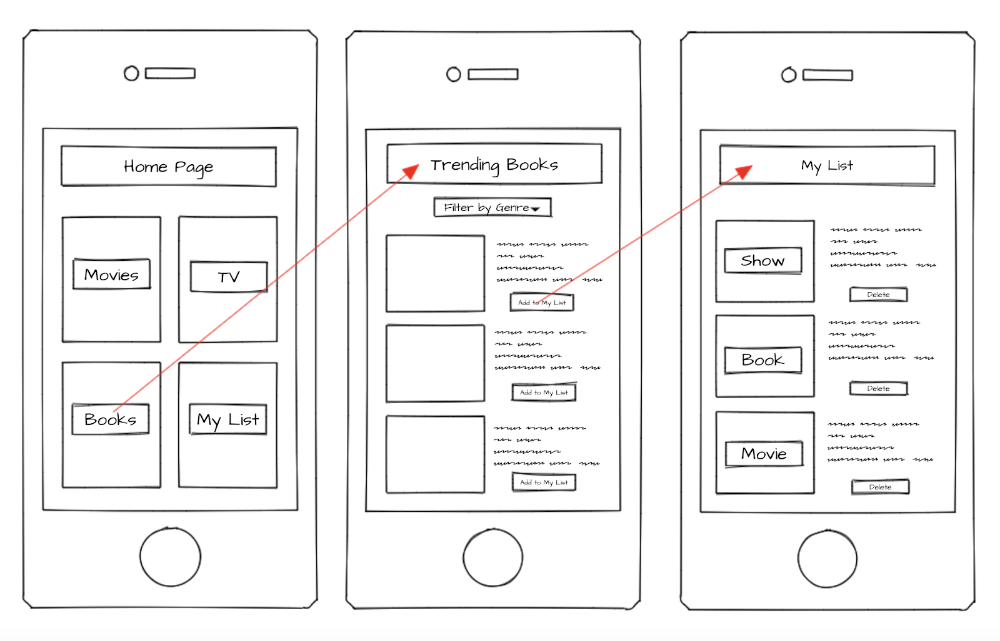

# [Quarentainment!](https://jpreston-alt.github.io/Quarentainment/)

## Project Description

This application allows the user to discover new content to keep them entertained by browsing through lists of books, movies, and TV shows that are trending that week. They are able to browse for content based on popularity, NYT critics picks, and/ or a genre of their choosing. They are provided with info such as author, genre, rating, user score, and a short summary. If they are viewing books they are provided with a link to purchase the item, and if they're viewing movies they are provided with a link to the NYT critics review if available. When they find content they are interested in, and want to remember later on, they can add the item to their personal list. These items are saved locally on their device and they may come back to this list at any time to view content that they've saved. When they've finsihed watching or reading this item, or no longer are interested any more, they may delete it from their list at any time.

## User Story

AS a bored content consumer during a pandemic, I would like to visit a site and see entertainment options that match my interests. I would like to be able to keep a running list of items that interest me to refer back to at a later date.

## Wireframe

## APIs to be Used:

1. The Movie Database
1. NYT Books Bestsellers
1. NYT Movie Reviews

## Rough Breakdown of Tasks

1. Evaluate APIs for suitability and ease of use by creating a small demo:
   1. Results from the entertainment APIs given a hardcoded search parameter
   1. An event posted to a google calendar requiring the user to log into their google account
1. Finalize list of APIs and user prompts
1. Decide on a CSS framework
1. Create page elements based on our wireframe and list of user prompts
1. Build API calls using user prompts
1. Write javascript to update page with API responses
1. Create localstorage-based functionality to save and display user picks
1. Finalize page styling

## Contributors 
1. Joanna Preston
1. Jared Hennessy
1. Darryl Williams

## Final Product

[Presentation](https://docs.google.com/presentation/d/1pvZ3rgUWRPgU2WE8rQapWcu3h80zWPdLR9JtOz9KZ7s/edit?usp=sharing) /
[Google Doc](https://docs.google.com/document/d/1qSXLjNX8n7eSAlZKDSzRrDoXKOSOcxz3vYO1R1BT3Gc/edit?usp=sharing)
